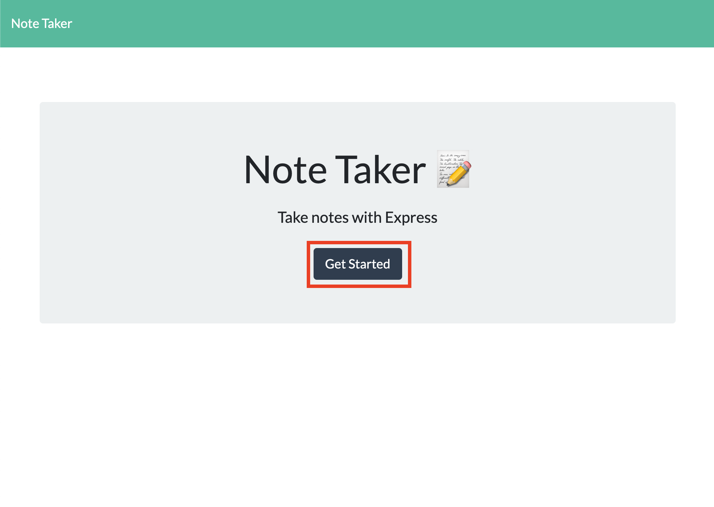
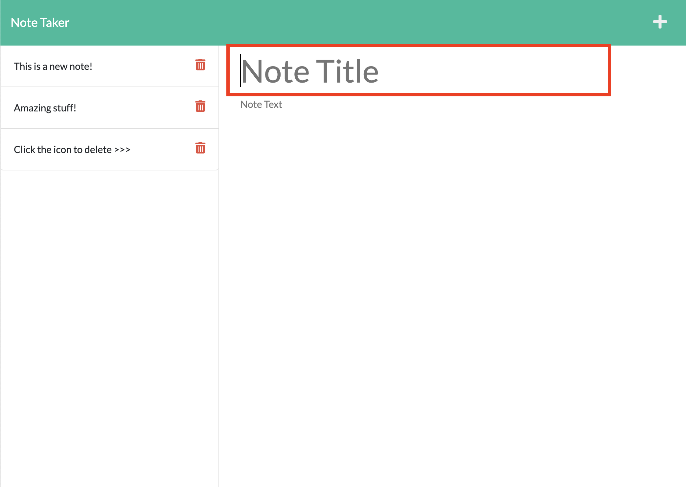
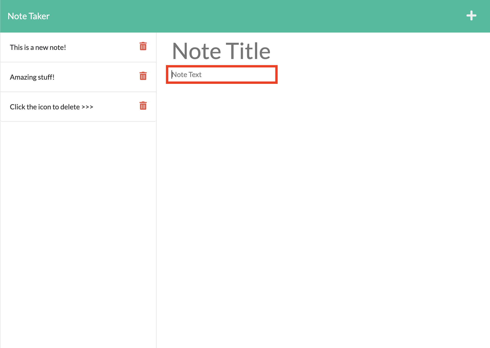
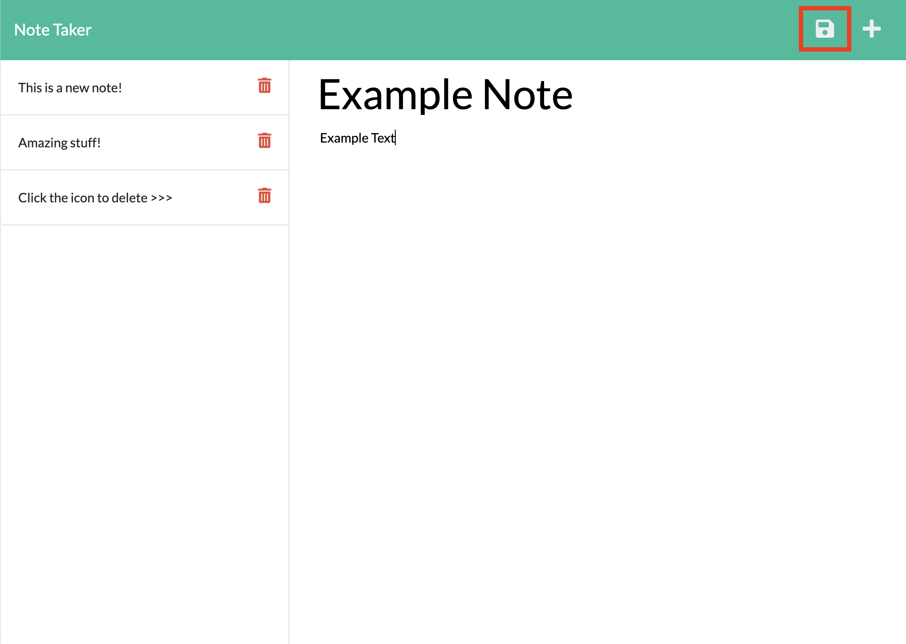
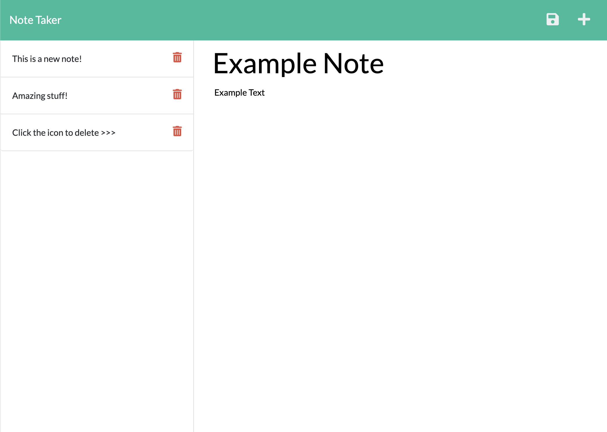

# Note Taker

## Description

Web application with Express.js back end. Create, save, and delete notes with ease 🎉

### Deployed Application

[Note Taker](https://ronchon-bastille-55338.herokuapp.com/)

## Table of Contents

- [Usage](#usage)

## Usage

1. Click on 'Get Started'
   
2. Select note title field to add a title to your note  
   
3. Select the note text to add details for your new note  
   
4. Click on the save icon on the top of the page to save note.  
   
5. Click the trashbin icon to delete any notes you no longer need!  
   

## License

## Questions

If you have any questions, you can reach me at:

- [GitHub: J0J0C0DING](https://github.com/J0J0C0DING)
- [joey.rebne@yahoo.com](mailto:joey.rebne@yahoo.com)
